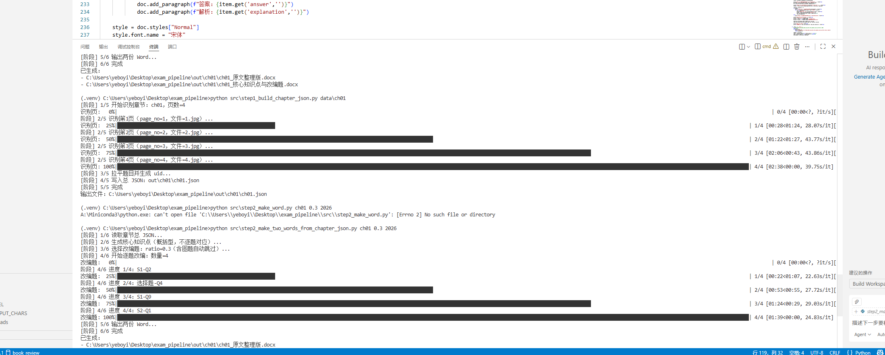

# Exam Pipeline（自动化习题改编）

本项目用于将现有习题资源（图片扫描件或 Word 文档）进行结构化归档与二次改编，便于沉淀题库、提升日常练习的题目多样性与复习效率。
1) 导出一份“原文整理版”Word，便于人工校验与归档  
2) 生成“核心知识点 + 随机抽题改编”Word，用于复习笔记与题目变式训练  

项目默认使用火山方舟（Volcengine Ark / 豆包）大模型：
- Step1：抽取题目（视觉识图或 docx 文本抽取），输出统一 JSON
- Step2：生成核心知识点，并按比例随机抽题改编，输出两个 Word 文档

---

## 功能概览

- **Step1（识图版）**：对章节文件夹内图片逐张识别，按页/大题/小题组织为章节 JSON
- **Step1（docx版）**：读取 docx（段落+表格），自动分段裁切后逐段抽题，合并为章节 JSON
- **Step2**：  
  - 根据全章题目摘要生成“核心知识点（复习笔记风格）”  
  - 从可改编题目中按比例随机抽样，逐题调用模型改编  
  - 输出两份 Word：原文整理版 + 核心知识点与改编题

---

## 运行环境

- Python **3.12.4**

---

## 依赖安装

建议使用虚拟环境：

```bash
python -m pip install --upgrade pip
python -m pip install volcengine-python-sdk[ark] python-dotenv python-docx tqdm
```

---


## 环境变量配置

在项目根目录创建 `.env`，至少包含以下字段：

```
ARK_API_KEY=你的火山方舟API Key
ARK_BASE_URL=https://ark.cn-beijing.volces.com/api/v3

# 文本模型：用于 Step2（知识点总结 + 改编题）
ARK_TEXT_MODEL=你的文本模型ID或EndpointID

# 视觉模型：用于识图版 Step1（如你使用）
ARK_VISION_MODEL=你的视觉模型ID或EndpointID
```

---

## 目录结构建议

```text
exam_pipeline/
  src/
    step1_build_chapter_json.py              # 图片识别
    step1_docx_build_chapter_json.py         # docx -> out/<ch>/<ch>.json
    step2_make_two_words_from_chapter_json.py# out/<ch>/<ch>.json -> 两份Word
  data/
    ch01/  # 注意:图片需要页码顺序编号
      1.jpg
      2.jpg
      ...
    docs/
      chapter1.docx
  out/
    ch01/
      ch01.json
      ch01_原文整理版.docx
      ch01_核心知识点与改编题.docx
```

---

## 使用方法（命令行）

### A. Step1（docx 题库 -> 章节 JSON）

将 docx 抽取为 step2 可直接使用的章节总 JSON：

```bash
python src\step1_docx_build_chapter_json.py ch01 "data\docs\chapter1.docx"
```

成功后生成：

* `out\ch01\ch01.json`

> 说明：docx 可能很长，step1 会自动裁切为多段，逐段调用模型抽题并合并；若模型输出非合法 JSON，会自动修复/二分重试，并在 `out\ch01\_debug\` 留下调试文件。

---

### B. Step1（识图：图片页 -> 章节 JSON）！！！图片需要页码顺序编号

如果你的章节是图片（扫描页），请先把图片放到章节文件夹（例如 `data\ch01\`），然后使用你现有的识图脚本生成章节 JSON（不同项目实现命令可能不同，下方给出常见形式）：

```bash
python src\step1_build_chapter_json.py
```

目标输出同样是：

* `out\ch01\ch01.json`

---

### C. Step2（章节 JSON -> 两份 Word）

当 `out\ch01\ch01.json` 已存在后，运行 step2：

```bash
python src\step2_make_two_words_from_chapter_json.py ch01 0.3 2026
```

参数说明：

* `ch01`：章节名（必须与 `out/<chapter>/<chapter>.json` 对应）
* `0.3`：抽题改编比例（例如 0.3 表示 30%）
* `2026`：随机种子（改变它会抽到不同题）

输出文件：

* `out\ch01\ch01_原文整理版.docx`
* `out\ch01\ch01_核心知识点与改编题.docx`

---

## 常见问题

* `PermissionError: ... .docx`
  通常是目标 Word 文件正在被 Word/WPS 打开或被预览窗格占用。关闭后重试，或删除旧文件再运行。

* Step1 报 JSON 解析错误
  一般是模型输出被截断或 JSON 不规范。docx 版 step1 已内置自动修复与自动二分重试；如仍失败可查看 `out/<chapter>/_debug/` 的原始回复。

---
## 运行截图



---
## 未来优化计划

- **并发化流水线**：将识图、抽取与改编等环节改为并发/异步执行，降低总体运行耗时。  
- **支持含图题目改编**：在现有纯文本改编的基础上，扩展为支持“题干/选项包含图片”的题目抽取与改编（当前版本仅支持纯文本题目改编）。

---
## License

个人学习与研究用途。

pandoc "h21_原文整理版.md" -f "markdown+tex_math_dollars+tex_math_double_backslash" -t docx -o "h21_原文整理版.docx"
pandoc "h21_核心知识点与改编题.md" -f "markdown+tex_math_dollars+tex_math_double_backslash" -t docx -o "h21_核心知识点与改编题.docx"
python src\step2_make_two_markdowns.py h11 --ratio 0.4 --seed 42